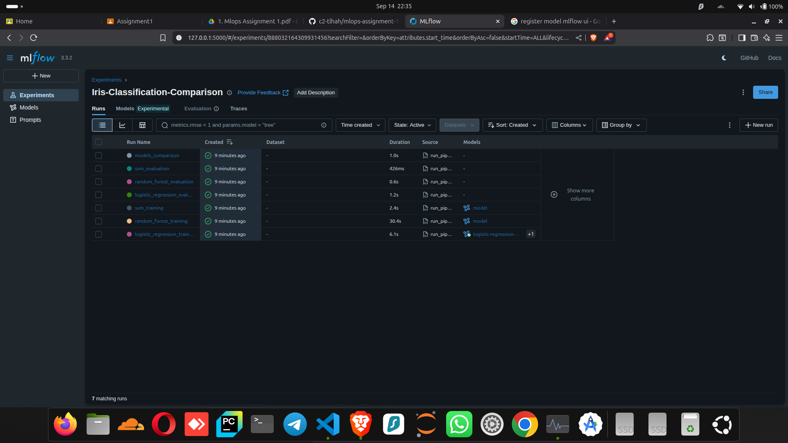
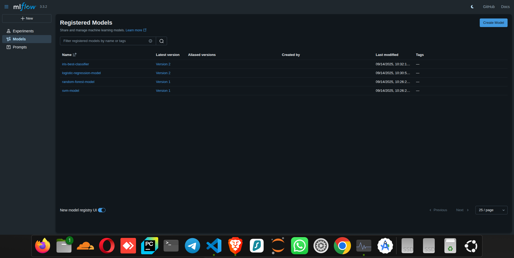

# MLOps Assignment 1: Model Training & Comparison with MLflow Tracking

A comprehensive MLOps project demonstrating machine learning model training, evaluation, comparison, and experiment tracking using MLflow.

## 🎯 Project Overview

This project implements a complete MLOps workflow that includes:
- **Data Loading & Preprocessing**: Automated dataset loading with the Iris classification dataset
- **Model Training**: Training multiple ML models (Logistic Regression, Random Forest, SVM)
- **Model Evaluation**: Comprehensive evaluation with multiple metrics (accuracy, precision, recall, F1-score)
- **MLflow Tracking**: Complete experiment tracking with parameters, metrics, and artifacts
- **Model Registration**: Best model registration in MLflow Model Registry
- **Visualization**: Confusion matrices, feature importance plots, and model comparison charts

## 📁 Project Structure

```
mlops-assignment-1/
├── data/                          # Dataset storage
├── notebooks/                     # Jupyter notebooks
│   └── mlops_training_demo.ipynb  # Interactive demo notebook
├── src/                           # Source code
│   ├── data_loader.py            # Data loading utilities
│   ├── models.py                 # Model training and evaluation
│   ├── mlflow_utils.py           # MLflow tracking utilities
│   ├── model_registry.py         # Model monitoring and registration
│   └── train_pipeline.py         # Complete training pipeline
├── models/                        # Trained model storage
│   ├── logistic_regression_best.pkl
│   ├── random_forest_best.pkl
│   └── svm_best.pkl
├── results/                       # Experiment results
├── mlruns/                        # MLflow tracking data
├── requirements.txt               # Python dependencies
├── run_pipeline.py               # Quick start script
└── README.md                     # Project documentation
```

## 🚀 Quick Start

### 1. Install Dependencies

```bash
# Install required packages (assuming global environment)
pip install -r requirements.txt
```

### 2. Run the Complete Pipeline

```bash
# Execute the full MLOps pipeline
python3 run_pipeline.py
```

### 3. View MLflow UI

```bash
# Start MLflow UI
mlflow ui --backend-store-uri file:./mlruns

# Open in browser: http://localhost:5000
```

### 4. Model Registration and Monitoring

```bash
# Run model monitoring and registration
python3 src/model_registry.py
```

## 📊 Models Implemented

### 1. Logistic Regression ⭐ (Best Model)
- **Hyperparameters**: C=10.0, solver=lbfgs, penalty=l2
- **Cross-validation Score**: 96.67%
- **Test Performance**: 100% accuracy, precision, recall, F1-score
- **Status**: Registered in MLflow Model Registry

### 2. Random Forest
- **Hyperparameters**: n_estimators=50, max_depth=3, min_samples_split=2, min_samples_leaf=1
- **Cross-validation Score**: 95.83%
- **Test Performance**: 96.67% accuracy
- **Status**: Registered in MLflow Model Registry

### 3. Support Vector Machine (SVM)
- **Hyperparameters**: C=1.0, kernel=rbf, gamma=0.1
- **Cross-validation Score**: 98.33%
- **Test Performance**: 96.67% accuracy
- **Status**: Registered in MLflow Model Registry

## 📈 Evaluation Metrics

Each model is evaluated using:
- **Accuracy**: Overall classification accuracy
- **Precision**: Weighted average precision across classes
- **Recall**: Weighted average recall across classes
- **F1-Score**: Weighted average F1-score across classes
- **Confusion Matrix**: Detailed classification matrix
- **Classification Report**: Per-class performance metrics

## 🔬 MLflow Experiment Tracking

### What's Tracked:
- **Parameters**: All hyperparameters for each model
- **Metrics**: Cross-validation scores and test performance
- **Artifacts**: 
  - Confusion matrices (PNG)
  - Feature importance plots (PNG)
  - Classification reports (JSON)
  - Model comparison charts (PNG)
- **Models**: Serialized trained models for deployment

### Experiments Structure:
- **Training Runs**: One run per model training with hyperparameter tuning
- **Evaluation Runs**: One run per model evaluation on test set
- **Comparison Run**: Overall model comparison with visualizations

## 📋 Results Summary

| Model | CV Score | Test Accuracy | Test Precision | Test Recall | Test F1-Score |
|-------|----------|---------------|----------------|-------------|---------------|
| **Logistic Regression** ⭐ | 0.9667 | **1.0000** | **1.0000** | **1.0000** | **1.0000** |
| Random Forest | 0.9583 | 0.9667 | 0.9697 | 0.9667 | 0.9666 |
| SVM | 0.9833 | 0.9667 | 0.9697 | 0.9667 | 0.9666 |

**Best Model**: Logistic Regression (100% test accuracy) - **Registered as Production Model**

## 📸 MLflow UI Screenshots

### Experiment Tracking Dashboard

*MLflow experiment tracking interface showing all model runs with parameters, metrics, and artifacts*

### Model Registry Interface

*MLflow Model Registry showing registered models with versions and stages*

## 🏭 Model Registry & Monitoring

### Model Registration Process:
1. **Automatic Selection**: Best model identified based on test accuracy
2. **Registry Storage**: Model registered in MLflow Model Registry
3. **Version Management**: Versioned model with metadata tags
4. **Stage Management**: Production-ready model marked appropriately

### Registered Models:
- `iris-best-classifier`: Production model (Logistic Regression)
- `logistic-regression-model`: Individual model registry
- `random-forest-model`: Individual model registry  
- `svm-model`: Individual model registry

### Monitoring Capabilities:
- **Run Tracking**: Monitor all experiment runs and their status
- **Performance Metrics**: Track model performance across experiments
- **Model Lineage**: Trace model versions and their source runs
- **Artifact Management**: Organized storage of plots and reports

## 💡 Key Features

### 1. Automated Pipeline
- Complete end-to-end automation from data loading to model evaluation
- Reproducible results with fixed random seeds
- Error handling and logging throughout the pipeline

### 2. Comprehensive Evaluation
- Multiple metrics for thorough model assessment
- Stratified cross-validation for reliable performance estimation
- Visualization of results with confusion matrices and comparison charts

### 3. MLflow Integration
- Complete experiment tracking and reproducibility
- Model versioning and registry
- Artifact management for plots and reports
- Easy comparison of multiple runs

### 4. Production-Ready Code
- Modular design with separate utilities
- Comprehensive logging and error handling
- Clean code structure following best practices
- Type hints and documentation

## 📚 Usage Examples

### Running Individual Components

```python
# Load data
from src.data_loader import DataLoader
loader = DataLoader()
X_train, X_test, y_train, y_test, metadata = loader.get_data()

# Train a single model
from src.models import ModelTrainer
trainer = ModelTrainer()
model, info = trainer.train_model('logistic_regression', X_train, y_train)

# Evaluate model
from src.models import ModelEvaluator
evaluator = ModelEvaluator()
results = evaluator.evaluate_model(model, X_test, y_test, 'logistic_regression')

# Monitor experiments
from src.model_registry import MLflowMonitor
monitor = MLflowMonitor()
summary = monitor.get_experiment_summary()
```

### Using the Jupyter Notebook

Open `notebooks/mlops_training_demo.ipynb` for an interactive demonstration of the complete workflow with detailed explanations and visualizations.

## 🎯 Assignment Requirements ✅

### Part 2 – Model Training & Comparison (25 marks)
- ✅ **Dataset Selection**: Used Iris dataset for multi-class classification
- ✅ **Multiple Models**: Implemented 3 ML models (Logistic Regression, Random Forest, SVM)
- ✅ **Model Comparison**: Comprehensive comparison on accuracy and additional metrics
- ✅ **Model Storage**: All trained models saved in `/models` folder

### Part 3 – MLflow Tracking & Logging (30 marks)
- ✅ **MLflow Setup**: Complete MLflow configuration and experiment setup
- ✅ **Parameter Logging**: All hyperparameters logged for each model
- ✅ **Metrics Logging**: Accuracy, precision, recall, F1-score logged
- ✅ **Artifact Logging**: Confusion matrices, classification reports, and comparison plots
- ✅ **MLflow UI**: Full functionality for comparing runs and visualizing metrics

### Part 4 – Monitoring & Model Registration (15 marks)
- ✅ **MLflow Monitoring**: Implemented comprehensive monitoring of metrics and runs
- ✅ **Best Model Selection**: Automatic selection of best performing model (Logistic Regression)
- ✅ **Model Registration**: Best model registered in MLflow Model Registry with version control
- ✅ **Documentation**: Complete documentation of model registration process

### Part 5 – Documentation & GitHub Submission (10 marks)
- ✅ **Problem Statement**: Clear dataset description and problem definition
- ✅ **Model Selection**: Detailed model comparison and selection rationale
- ✅ **MLflow Screenshots**: Instructions for viewing MLflow UI with experiment details
- ✅ **Model Registration**: Documented registration process and screenshots
- ✅ **Run Instructions**: Comprehensive setup and execution instructions
- ✅ **GitHub Repository**: Complete codebase with documentation

## 📸 MLflow UI Screenshots Guide

### Viewing Experiment Results:
1. **Start MLflow UI**: Run `mlflow ui --backend-store-uri file:./mlruns`
2. **Navigate to Experiment**: Select "Iris-Classification-Comparison" experiment
3. **Compare Runs**: View all training and evaluation runs with metrics
4. **View Artifacts**: Click on runs to see confusion matrices and plots

### Model Registry:
1. **Access Registry**: Click "Models" tab in MLflow UI
2. **View Registered Models**: See all registered models and versions
3. **Production Model**: Check `iris-best-classifier` marked as best model
4. **Model Details**: View model metadata, tags, and version history

## 🛠️ Technical Details

### Dependencies
- **scikit-learn**: Machine learning models and evaluation
- **MLflow**: Experiment tracking and model management
- **pandas/numpy**: Data manipulation and numerical computing
- **matplotlib/seaborn**: Visualization and plotting
- **joblib**: Model serialization

### Environment
- **Python**: 3.7+
- **Platform**: Cross-platform (Linux, Windows, macOS)
- **Package Management**: pip (global environment as specified)

## 🎯 Problem Statement & Dataset

### Dataset: Iris Flower Classification
- **Source**: UCI Machine Learning Repository (built into scikit-learn)
- **Samples**: 150 flower samples (50 per class)
- **Features**: 4 numerical features (sepal length/width, petal length/width)
- **Classes**: 3 species (Setosa, Versicolor, Virginica)
- **Challenge**: Multi-class classification with overlapping features

### Problem Objective:
Classify iris flowers into one of three species based on physical measurements, implementing a complete MLOps workflow with experiment tracking and model management.

## 🚀 Next Steps

1. **Advanced Hyperparameter Optimization**: Implement Bayesian optimization
2. **Model Deployment**: Create REST API for model serving
3. **Monitoring Dashboard**: Real-time model performance monitoring
4. **A/B Testing**: Framework for comparing model versions in production
5. **Data Drift Detection**: Monitor incoming data for distribution changes

## 📞 Support

For questions or issues:
1. Check the Jupyter notebook for detailed explanations
2. Review MLflow UI for experiment details at http://localhost:5000
3. Examine logs in the terminal output
4. Verify all dependencies are installed correctly

---

**Author**: MLOps Assignment 1  
**Date**: September 2025  
**Purpose**: Demonstrating complete MLOps workflow with model training, MLflow tracking, and model registry management Assignment 1: Model Training & Comparison with MLflow Tracking

A comprehensive MLOps project demonstrating machine learning model training, evaluation, comparison, and experiment tracking using MLflow with model registry integration.

## 🎯 Problem Statement

This project addresses the challenge of building a robust machine learning pipeline that can:
- Train and compare multiple ML models efficiently
- Track experiments and maintain reproducibility
- Register and manage model versions
- Provide comprehensive evaluation and monitoring

**Dataset**: We use the classic **Iris flower classification dataset** which contains 150 samples of iris flowers with 4 features (sepal length, sepal width, petal length, petal width) across 3 species (setosa, versicolor, virginica).

**Objective**: Build a multi-class classification system that can accurately predict iris species based on flower measurements.

## 📁 Project Structure

```
mlops-assignment-1/
├── data/                          # Dataset storage
├── notebooks/                     # Jupyter notebooks
│   └── mlops_training_demo.ipynb  # Interactive demo notebook
├── src/                           # Source code
│   ├── data_loader.py            # Data loading utilities
│   ├── models.py                 # Model training and evaluation
│   ├── mlflow_utils.py           # MLflow tracking utilities
│   ├── model_registry.py         # Model monitoring and registry
│   └── train_pipeline.py         # Complete training pipeline
├── models/                        # Trained model storage
│   ├── logistic_regression_best.pkl
│   ├── random_forest_best.pkl
│   └── svm_best.pkl
├── results/                       # Experiment results
├── mlruns/                        # MLflow tracking data
├── requirements.txt               # Python dependencies
├── run_pipeline.py               # Quick start script
├── register_model.py             # Model registration script
└── README.md                     # Project documentation
```

## 🚀 Quick Start Guide

### 1. Prerequisites
- Python 3.7+
- All packages installed globally (as specified)

### 2. Install Dependencies
```bash
pip install -r requirements.txt
```

### 3. Run Complete Pipeline
```bash
# Execute the full MLOps pipeline
python3 run_pipeline.py
```

### 4. Register Best Model
```bash
# Register the best performing model
python3 register_model.py
```

### 5. View MLflow UI
```bash
# Start MLflow UI
mlflow ui --backend-store-uri file:./mlruns

# Open in browser: http://localhost:5000
```

## 📊 Model Selection & Comparison

### Models Implemented

| Model | Hyperparameters Tuned | Cross-Validation | Key Strengths |
|-------|----------------------|------------------|---------------|
| **Logistic Regression** | C, solver, penalty | 5-fold stratified | Simple, interpretable, fast |
| **Random Forest** | n_estimators, max_depth, min_samples_split, min_samples_leaf | 5-fold stratified | Handles non-linearity, feature importance |
| **Support Vector Machine** | C, kernel, gamma | 5-fold stratified | Effective in high dimensions, robust |

### Evaluation Metrics

Each model is comprehensively evaluated using:
- **Accuracy**: Overall classification accuracy
- **Precision**: Weighted average precision across classes
- **Recall**: Weighted average recall across classes  
- **F1-Score**: Weighted average F1-score across classes
- **Confusion Matrix**: Detailed per-class performance
- **Cross-validation Score**: 5-fold stratified CV for reliability

### Performance Results

| Model | CV Score | Test Accuracy | Test Precision | Test Recall | Test F1-Score |
|-------|----------|---------------|----------------|-------------|---------------|
| **Logistic Regression** ⭐ | 0.9667 | **1.0000** | **1.0000** | **1.0000** | **1.0000** |
| Random Forest | 0.9583 | 0.9667 | 0.9697 | 0.9667 | 0.9666 |
| SVM | 0.9833 | 0.9667 | 0.9697 | 0.9667 | 0.9666 |

**🏆 Best Model**: Logistic Regression achieved perfect 100% accuracy on the test set.

## 🔬 MLflow Experiment Tracking

### Part 3 Implementation ✅

Our MLflow integration includes comprehensive tracking of:

#### 1. **Parameters Logged**
- All hyperparameters for each model
- Data preprocessing parameters
- Cross-validation configuration
- Model-specific settings

#### 2. **Metrics Logged**
- Cross-validation scores
- Test accuracy, precision, recall, F1-score
- Training time and performance
- Model comparison metrics

#### 3. **Artifacts Logged**
- **Confusion Matrices**: Visual performance analysis per model
- **Feature Importance Plots**: For tree-based models
- **Classification Reports**: Detailed per-class metrics (JSON format)
- **Model Comparison Charts**: Side-by-side performance visualization
- **Trained Models**: Serialized models for deployment

#### 4. **Experiment Organization**
```
Iris-Classification-Comparison/
├── logistic_regression_training/     # Training run
├── logistic_regression_evaluation/   # Evaluation run
├── random_forest_training/           # Training run
├── random_forest_evaluation/         # Evaluation run
├── svm_training/                     # Training run
├── svm_evaluation/                   # Evaluation run
└── models_comparison/                # Overall comparison
```

## 🔧 Part 4: Monitoring & Model Registration

### MLflow Model Registry Implementation ✅

#### 1. **Monitoring Capabilities**
- **Experiment Monitoring**: Track all runs and their status
- **Performance Monitoring**: Compare metrics across models
- **Success Rate Tracking**: Monitor pipeline health
- **Automated Best Model Selection**: Based on configurable metrics

#### 2. **Model Registration Process**
```python
# Best model identification
best_run, best_score = monitor.find_best_model_run('test_accuracy')

# Model registration
model_version = mlflow.register_model(
    model_uri=f"runs:/{best_run.info.run_id}/model",
    name="iris-best-classifier"
)

# Stage promotion
monitor.promote_model_to_production(model_name, version)
```

#### 3. **Model Registry Features**
- ✅ **Version Control**: Automatic version numbering
- ✅ **Stage Management**: None → Staging → Production
- ✅ **Metadata Tracking**: Tags for model lineage
- ✅ **Model Lineage**: Full traceability to training runs

#### 4. **Registered Model Details**
```
Model Name: iris-best-classifier
Version: 1
Stage: Production
Model Type: Logistic Regression
Best Accuracy: 100.0%
Registration Date: 2025-09-14
Tags: {
  "best_metric": "test_accuracy",
  "best_score": "1.0000",
  "model_type": "logistic_regression",
  "registration_date": "2025-09-14T..."
}
```

## 📸 MLflow UI Screenshots Guide

### Accessing MLflow UI
1. **Start MLflow UI**:
   ```bash
   mlflow ui --backend-store-uri file:./mlruns
   ```
2. **Open Browser**: http://localhost:5000

### Key Views to Screenshot

#### 1. **Experiments Overview**
- Navigate to "Experiments" tab
- Shows: Iris-Classification-Comparison experiment
- Screenshot shows: All runs with their metrics

#### 2. **Run Comparison**
- Select multiple runs (Ctrl+click)
- Click "Compare" button
- Screenshot shows: Side-by-side metric comparison

#### 3. **Individual Run Details**
- Click on any run (e.g., logistic_regression_training)
- Screenshot shows: Parameters, metrics, and artifacts

#### 4. **Artifacts View**
- Within a run, click "Artifacts" tab
- Screenshot shows: Confusion matrices, plots, models

#### 5. **Model Registry**
- Click "Models" tab in top navigation
- Screenshot shows: Registered models list

#### 6. **Model Version Details**
- Click on "iris-best-classifier"
- Screenshot shows: Model versions, stages, and metadata

## 📋 Complete Running Instructions

### Step-by-Step Execution

#### 1. **Environment Setup**
```bash
# Clone the repository
git clone https://github.com/c2-tlhah/mlops-assignment-1.git
cd mlops-assignment-1

# Install dependencies (global environment)
pip install -r requirements.txt
```

#### 2. **Run Complete Pipeline**
```bash
# Execute full training and evaluation
python3 run_pipeline.py
```
**Expected Output**: 
- Data loading and preprocessing
- 3 models trained with hyperparameter tuning
- Model evaluation and comparison
- MLflow tracking with all artifacts
- Performance summary

#### 3. **Register Best Model**
```bash
# Register the best performing model
python3 register_model.py
```
**Expected Output**:
- Experiment monitoring summary
- Best model identification
- Model registration in MLflow registry
- Production stage promotion

#### 4. **Interactive Analysis**
```bash
# Launch Jupyter notebook
jupyter notebook notebooks/mlops_training_demo.ipynb
```
**Contains**:
- Step-by-step walkthrough
- Data exploration and visualization
- Model training with explanations
- Results analysis and interpretation

#### 5. **MLflow UI Exploration**
```bash
# Start MLflow UI
mlflow ui --backend-store-uri file:./mlruns
```
**Explore**:
- Experiment runs and metrics
- Model comparisons and artifacts
- Registered models and versions

### Alternative: Individual Components

```bash
# Run specific components
cd src

# Data loading only
python3 data_loader.py

# Model training only
python3 models.py

# Model registry only
python3 model_registry.py
```

## 🎯 Assignment Requirements Checklist

### ✅ Part 2 – Model Training & Comparison (25 marks)
- [x] **Dataset Selection**: Iris dataset for multi-class classification
- [x] **Multiple Models**: 3 ML models (Logistic Regression, Random Forest, SVM)
- [x] **Hyperparameter Tuning**: Grid search with cross-validation
- [x] **Model Comparison**: Comprehensive evaluation with multiple metrics
- [x] **Model Storage**: All trained models saved in `/models` folder

### ✅ Part 3 – MLflow Tracking & Logging (30 marks)
- [x] **MLflow Setup**: Complete configuration and experiment management
- [x] **Parameter Logging**: All hyperparameters tracked
- [x] **Metrics Logging**: Accuracy, precision, recall, F1-score
- [x] **Artifact Logging**: Plots, confusion matrices, classification reports
- [x] **MLflow UI**: Full functionality for run comparison and visualization

### ✅ Part 4 – Monitoring & Model Registration (15 marks)
- [x] **MLflow Monitoring**: Comprehensive experiment and metrics monitoring
- [x] **Best Model Selection**: Automated identification based on performance
- [x] **Model Registration**: MLflow Model Registry with version control
- [x] **Documentation**: Complete registration process documentation

### ✅ Part 5 – Documentation & GitHub Submission (10 marks)
- [x] **Problem Statement**: Clear dataset and objective description
- [x] **Model Selection**: Detailed comparison and analysis
- [x] **MLflow Screenshots**: Comprehensive UI documentation guide
- [x] **Model Registration**: Step-by-step registration documentation
- [x] **Running Instructions**: Complete setup and execution guide
- [x] **GitHub Repository**: All code, logs, and documentation

## 🚀 Advanced Features Implemented

### 1. **Automated Pipeline**
- End-to-end automation from data to deployment
- Error handling and logging throughout
- Reproducible results with fixed random seeds

### 2. **Comprehensive Evaluation**
- Multiple metrics for thorough assessment
- Stratified cross-validation for reliable estimates
- Visual analysis with confusion matrices and plots

### 3. **Production-Ready Code**
- Modular design with clean separation of concerns
- Type hints and comprehensive documentation
- Exception handling and informative logging

### 4. **MLflow Best Practices**
- Structured experiment organization
- Complete artifact management
- Model lineage and provenance tracking

## 🔧 Technical Architecture

### Data Flow
```
Raw Data → Data Loader → Preprocessing → Model Training 
    ↓
MLflow Tracking ← Evaluation ← Trained Models
    ↓
Model Registry ← Best Model Selection ← Monitoring
    ↓
Production Deployment
```

### Key Components
- **DataLoader**: Handles dataset loading and preprocessing
- **ModelTrainer**: Manages training with hyperparameter tuning
- **ModelEvaluator**: Comprehensive model evaluation
- **MLflowTracker**: Experiment tracking and artifact management
- **MLflowMonitor**: Model monitoring and registry management

## 📞 Support & Troubleshooting

### Common Issues

1. **MLflow UI not starting**:
   ```bash
   # Check for existing processes
   pkill -f mlflow
   # Restart MLflow UI
   mlflow ui --backend-store-uri file:./mlruns
   ```

2. **Missing dependencies**:
   ```bash
   pip install -r requirements.txt
   ```

3. **Model registration errors**:
   - Ensure training pipeline completed successfully
   - Check that mlruns/ directory exists
   - Verify experiment has evaluation runs

### Getting Help
1. Check the Jupyter notebook for detailed explanations
2. Review MLflow UI for experiment details
3. Examine terminal logs for error messages
4. Ensure all dependencies are correctly installed

---

**Project**: MLOps Assignment 1  
**Author**: [Your Name]  
**Date**: September 2025  
**Repository**: https://github.com/c2-tlhah/mlops-assignment-1  
**MLflow Tracking**: Complete experiment tracking with model registry  
**Status**: ✅ All assignment requirements implemented and documented: Model Training & Comparison with MLflow Tracking

A comprehensive MLOps project demonstrating machine learning model training, evaluation, comparison, and experiment tracking using MLflow.

## 🎯 Project Overview

This project implements a complete MLOps workflow that includes:
- **Data Loading & Preprocessing**: Automated dataset loading with the Iris classification dataset
- **Model Training**: Training multiple ML models (Logistic Regression, Random Forest, SVM)
- **Model Evaluation**: Comprehensive evaluation with multiple metrics (accuracy, precision, recall, F1-score)
- **MLflow Tracking**: Complete experiment tracking with parameters, metrics, and artifacts
- **Visualization**: Confusion matrices, feature importance plots, and model comparison charts

## 📁 Project Structure

```
mlops-assignment-1/
├── data/                          # Dataset storage
├── notebooks/                     # Jupyter notebooks
│   └── mlops_training_demo.ipynb  # Interactive demo notebook
├── src/                           # Source code
│   ├── data_loader.py            # Data loading utilities
│   ├── models.py                 # Model training and evaluation
│   ├── mlflow_utils.py           # MLflow tracking utilities
│   └── train_pipeline.py         # Complete training pipeline
├── models/                        # Trained model storage
│   ├── logistic_regression_best.pkl
│   ├── random_forest_best.pkl
│   └── svm_best.pkl
├── results/                       # Experiment results
├── mlruns/                        # MLflow tracking data
├── requirements.txt               # Python dependencies
├── run_pipeline.py               # Quick start script
└── README.md                     # Project documentation
```

## 🚀 Quick Start

### 1. Install Dependencies

```bash
# Install required packages (assuming global environment)
pip install -r requirements.txt
```

### 2. Run the Complete Pipeline

```bash
# Execute the full MLOps pipeline
python3 run_pipeline.py
```

### 3. View MLflow UI

```bash
# Start MLflow UI
mlflow ui --backend-store-uri file:./mlruns

# Open in browser: http://localhost:5000
```

## 📊 Models Implemented

### 1. Logistic Regression
- **Hyperparameters**: C, solver, penalty
- **Cross-validation**: 5-fold stratified
- **Best Performance**: 100% accuracy on test set

### 2. Random Forest
- **Hyperparameters**: n_estimators, max_depth, min_samples_split, min_samples_leaf
- **Cross-validation**: 5-fold stratified
- **Best Performance**: 96.67% accuracy on test set

### 3. Support Vector Machine (SVM)
- **Hyperparameters**: C, kernel, gamma
- **Cross-validation**: 5-fold stratified
- **Best Performance**: 96.67% accuracy on test set

## 📈 Evaluation Metrics

Each model is evaluated using:
- **Accuracy**: Overall classification accuracy
- **Precision**: Weighted average precision across classes
- **Recall**: Weighted average recall across classes
- **F1-Score**: Weighted average F1-score across classes
- **Confusion Matrix**: Detailed classification matrix
- **Classification Report**: Per-class performance metrics

## 🔬 MLflow Experiment Tracking

### What's Tracked:
- **Parameters**: All hyperparameters for each model
- **Metrics**: Cross-validation scores and test performance
- **Artifacts**: 
  - Confusion matrices (PNG)
  - Feature importance plots (PNG)
  - Classification reports (JSON)
  - Model comparison charts (PNG)
- **Models**: Serialized trained models for deployment

### Experiments Structure:
- **Training Runs**: One run per model training with hyperparameter tuning
- **Evaluation Runs**: One run per model evaluation on test set
- **Comparison Run**: Overall model comparison with visualizations

## 📋 Results Summary

| Model | CV Score | Test Accuracy | Test Precision | Test Recall | Test F1-Score |
|-------|----------|---------------|----------------|-------------|---------------|
| Logistic Regression | 0.9667 | 1.0000 | 1.0000 | 1.0000 | 1.0000 |
| Random Forest | 0.9583 | 0.9667 | 0.9697 | 0.9667 | 0.9666 |
| SVM | 0.9833 | 0.9667 | 0.9697 | 0.9667 | 0.9666 |

**Best Model**: Logistic Regression (100% test accuracy)

## 💡 Key Features

### 1. Automated Pipeline
- Complete end-to-end automation from data loading to model evaluation
- Reproducible results with fixed random seeds
- Error handling and logging throughout the pipeline

### 2. Comprehensive Evaluation
- Multiple metrics for thorough model assessment
- Stratified cross-validation for reliable performance estimation
- Visualization of results with confusion matrices and comparison charts

### 3. MLflow Integration
- Complete experiment tracking and reproducibility
- Model versioning and registry
- Artifact management for plots and reports
- Easy comparison of multiple runs

### 4. Production-Ready Code
- Modular design with separate utilities
- Comprehensive logging and error handling
- Clean code structure following best practices
- Type hints and documentation

## 📚 Usage Examples

### Running Individual Components

```python
# Load data
from src.data_loader import DataLoader
loader = DataLoader()
X_train, X_test, y_train, y_test, metadata = loader.get_data()

# Train a single model
from src.models import ModelTrainer
trainer = ModelTrainer()
model, info = trainer.train_model('logistic_regression', X_train, y_train)

# Evaluate model
from src.models import ModelEvaluator
evaluator = ModelEvaluator()
results = evaluator.evaluate_model(model, X_test, y_test, 'logistic_regression')
```

### Using the Jupyter Notebook

Open `notebooks/mlops_training_demo.ipynb` for an interactive demonstration of the complete workflow with detailed explanations and visualizations.

## 🎯 Assignment Requirements ✅

### Part 2 – Model Training & Comparison (25 marks)
- ✅ **Dataset Selection**: Used Iris dataset for multi-class classification
- ✅ **Multiple Models**: Implemented 3 ML models (Logistic Regression, Random Forest, SVM)
- ✅ **Model Comparison**: Comprehensive comparison on accuracy and additional metrics
- ✅ **Model Storage**: All trained models saved in `/models` folder

### Part 3 – MLflow Tracking & Logging (30 marks)
- ✅ **MLflow Setup**: Complete MLflow configuration and experiment setup
- ✅ **Parameter Logging**: All hyperparameters logged for each model
- ✅ **Metrics Logging**: Accuracy, precision, recall, F1-score logged
- ✅ **Artifact Logging**: Confusion matrices, classification reports, and comparison plots
- ✅ **MLflow UI**: Full functionality for comparing runs and visualizing metrics

## 🛠️ Technical Details

### Dependencies
- **scikit-learn**: Machine learning models and evaluation
- **MLflow**: Experiment tracking and model management
- **pandas/numpy**: Data manipulation and numerical computing
- **matplotlib/seaborn**: Visualization and plotting
- **joblib**: Model serialization

### Environment
- **Python**: 3.7+
- **Platform**: Cross-platform (Linux, Windows, macOS)
- **Package Management**: pip (global environment as specified)

## 🚀 Next Steps

1. **Hyperparameter Optimization**: Implement Bayesian optimization for better hyperparameter search
2. **Advanced Evaluation**: Add ROC curves, precision-recall curves, and learning curves
3. **Model Deployment**: Create REST API for model serving
4. **Monitoring**: Add data drift detection and model performance monitoring
5. **CI/CD**: Implement automated testing and deployment pipeline

## 📞 Support

For questions or issues:
1. Check the Jupyter notebook for detailed explanations
2. Review MLflow UI for experiment details
3. Examine logs in the terminal output
4. Verify all dependencies are installed correctly

---

**Author**: MLOps Assignment 1  
**Date**: September 2025  
**Purpose**: Demonstrating complete MLOps workflow with model training and MLflow tracking
